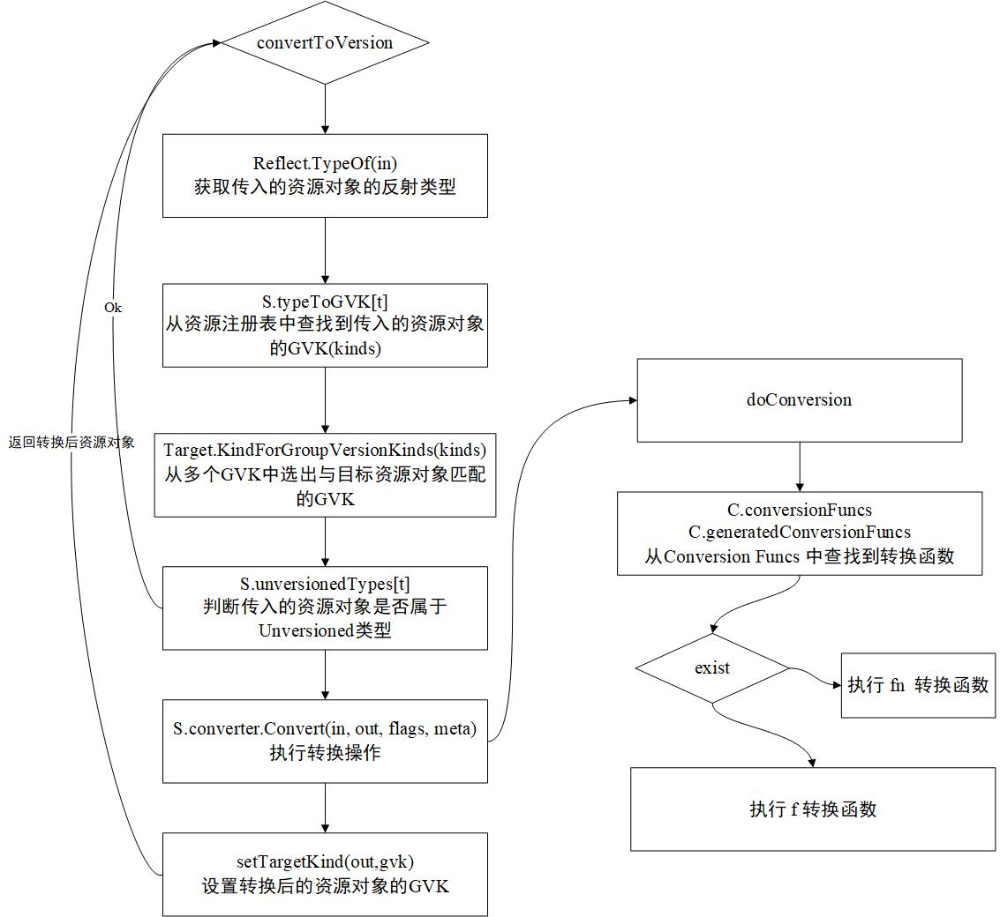

## 数据

### 结构化数据

预先知道数据结构的数据类型是结构化数据。要使用这种数据，需要创建一个 struct 数据结构，并且可以通过 Go 语言的 json 库进行反序列化操作。

### 非结构化数据

无法预知数据结构的数据类型或属性名称不确定的数据类型是非结构化数据，其无法通过构建预定的 struct 数据结构来序列化或反序列化数据。

可以通过如下结构来解决问题：

```
var result map[string]interface{}
```

> interface {}类型对应值，可以是任何类型，使用 interface 字段时，通过 Go 语言断言的方式进行类型转换。

```
if description, ok := result["description"].(string); ok {
    fmt.Println(description)
}
```

## Scheme 资源注册表

Kubernetes 系统拥有众多资源，每一种资源就是一个资源类型，这些资源类型需要有统一的注册、存储、查询、管理等机制。目前 Kubernetes 系统中的所有资源类型都已注册到 Scheme 资源注册表中，其是一个内存型的资源注册表。

Scheme 资源注册表支持如下两种类型：

* UnversionedType: 无版本资源类型，这是早期 Kubernetes 系统中的概念，它主要应用于某些没有版本的资源类型，该类型的资源对象并不需要进行转换。

* KnownType: 目前 Kubernetes 最常用的资源类型，也可称其为“拥有版本的资源类型”。

### Scheme 资源注册表数据结构

Scheme 资源注册表数据结构主要由4个map结构组成，分别是：

```
type Scheme struct {
    gvkToType map[scheme.GroupVersionKind]reflect.Type
    // 存储 GVK 与 Type 的映射关系
    
    typeToGVK map[reflect.Type][]scheme.GroupVersionKind
    // 存储 Type 与 GVK 的映射关系，一个 Type 会对应一个或多个 GVK
    
    unversionedTypes map[reflect.Type]scheme.GroupVersionKind
    // 存储 UnversionedType 与 GVK 的映射关系
    
    unversionedKinds map[string]reflect.Type
    // 存储 Kind 名称与 UnversionedType 的映射关系 
}
```

> 这些映射关系可以实现高效的正向和反向检索。

Scheme 资源注册表在 Kubernetes 系统体系中属于非常核心的数据结构，Scheme Example 代码示例如下：

```
func main() {
    // KnownType external
    coreGV := schema.GroupVersion{Group:"", Version: "v1"}
    extensionsGV := schema.GroupVersion{Group: "extensions", Version: "v1beta1"}
    
    // KnownType internal
    coreInternalGV := schema.GroupVersion{Group: "", Version: runtime.APIVersionInternal}

    // UnversionedType 
    Unversioned := schema.GroupVersion{Group: "", Version: "v1"}

    schema := runtime.NewScheme()
    scheme.AddKnownTypes(coreGV, &corev1.Pod{})
    scheme.AddKnownTypes(extensionsGV, &appsv1.DaemonSet{})
    scheme.AddKnownTypes(coreInternalGV, &corev1.Pod{})
    scheme.AddUnversionedTypes(Unversioned, &metav1.Status{})
    // 注册资源类型到 Scheme 资源注册表有以上两种方式
}
```

* GVK 在 Scheme 资源注册表中以 <group>/<version>,Kind=<kind>的形式存在，其中对于 Kind 字段，在注册时如果不指定该字段的名称，那么默认使用类型的名称，通过 reflect 机制获取资源类型的名称。

* 资源类型在 Scheme 资源注册表中以 Go Type（通过 reflect 机制获取）形式存在。

> 需要注意的是，UnversionecdType 类型的对象在通过 scheme.AddUnversionedTypes 方法注册时，会同时存在4个 map 结构中，代码示例如下：

```
func (s *Scheme) AddUnversionedTypes(version schema.GroupVersion, types ...Object) {
    ...
    s.AddKnownTypes(version, types...)
    // 1
    for _, obj := range types {
        t := reflect.TypeOf(obj).Elem()
        gvk := version.WithKind(t.Name())
        // 2
        s.unversionedTypes[t] = gvk
        // 3
        ...
        s.unversionedKinds[gvk.Kind] = t
        // 4
    }
}
```

### 资源注册表注册方法

在 Scheme 资源注册表中，不同的资源类型使用的注册方法不同，分别如下：

* scheme.AddUnversionedTypes: 注册 UnversionedType 资源类型
* scheme.AddKnownTypes: 注册 KnownType 资源类型
* scheme.AddKnownTypesWithName: 注册 KnownType 资源类型，须指定资源的 Kind 资源种类名称

举例 scheme.AddKnownTypes 如下:

```
func (s *Scheme) AddKnownTypes(gv schema.GroupVersion,types ...object){
    s.addObservedVersion(gv)
    for _, obj := range types {
        t := reflect.Typeof(obj)
        // 通过 reflect 机制获取资源类型的名称作为资源种类名称
        if t.Kind() != reflect.Ptr {
            panic("All types must be pointers to structs.")
        }
        t = t.Elem()
        s.AddKnownTypeWithName(gv.WithKind(t.Name()), obj)
        // 调用这种注册方法
    }
}
```

## Codec 编解码器

* Serializer: 序列化器，包含序列化操作与反序列化操作

* Codec: 编解码器，包含编码器和解码器。
> 编解码器指的是可以表示数据的任何格式，或者将数据转换为特定格式的过程。

```
type Encoder interface{}
// 编码器
type Decoder interface{}
// 解码器
type Serializer interface{
    Encoder
    Decoder
}
// 只要实现了 Encoder 与 Decoder 方法的数据结构，就是序列化器
type Codec Serialier
```

Codec 编解码器包含3中序列化器：
1. jsonSerializer: JSON 格式序列化/反序列化器。
2. yamlSerializer: YAML 格式序列化/反序列化器。
3. protobufSerializer: Protobuf 格式序列化/反序列化器。
> 都使用 ContentType 作为标识。

### Codec 编解码实例化

Codec 编解码器通过 NewCodecFactory 函数实例化，NewCodecFactory -> newSerializersForSchem。
分别都是通过 json.NewSerializer/json.NewYAMLSerializer/protobuf.NewSerializer 函数进行实例化。

### json 和 yaml 序列化器

* json 序列化器使用 Go 语言标准库 encoding/json 来实现序列化和反序列化。
* yaml 序列化器使用第三方库 gopkg.in/yaml.v2 来实现序列化和反序列化。

* json 和 yaml 序列化器共享同一个数据结构，通过 yaml 字段区分，如果该字段为 true 则使用 yaml 序列化器，否则为使用 json 序列化器。

* 如果是 yaml 格式，第一步通过 caseSensitiveJsonIterator.Marshal 函数将资源对象转换为 Json 格式，第二步通过 yaml.JSONToYAML 将 JSON 格式转换为 YAML 格式并返回数据。

* 如果是 JSON 格式，则通过 Go 语言标准库将资源对象转换为 JSON 格式。其中如果 pretty 参数开启的话，则通过 caseSensitiveJsonIterator.MarshalIndent 函数优化 JSON 格式。
> caseSensitiveJsonIterator 函数实际封装了 github.com/json-iterator/go 第三方库，json-iterator 有如下几个好处。
> 1. json-iterator 支持区分大小写。
> 2. json-iterator 性能更优。
> 3. json-iterator 100% 兼容 Go 语言标准库。

### protobufSerializer 序列化器

protobuf 序列化器使用 proto 库来实现序列化和反序列操作。

* 前缀有 magic-number 特殊标识。

## Converter 资源版本转换器

可以通过 kubectl convert 命令进行资源版本转换：

```
$ kubectl convert -f v1beta1Deployment.yaml --output-version=apps/v1
apiVersion: apps/v1
kind: Deployment 
```

kubernetes 系统中一个资源支持多个资源版本，每个资源版本都支持其他资源版本的转换，随着资源版本的增加，资源版本转换的定义会越来越多，这样处理起来非常麻烦。
因此 kubernetes 通过内部版本机制实现资源版本转换。
* 当需要在两个资源版本之间转换时，Converter 资源版本转换器先将第一个资源版本转换为 __internal 内部版本，再转换为相应的资源版本。
* 每个资源只要能支持内部版本，就能与其他任何资源版本进行间接的资源版本转换。

### Converter 转换器数据结构

Converter 转换器数据结构主要存放转换函数（即 Conversion Funcs）。

```
type Converter struct {
    conversionFuncs          ConversionFuncs
    // 默认转换函数
    generatedConversionFuncs ConversionFuncs
    // 自动生成的转换函数
    ignoredConversions       map[typePair]stuct{}
    // 若资源对象注册到此字段，则忽略此资源对象的转换操作
    nameFunc                 func(t reflect.Type) string
    // 在转换过程中其用于获取资源种类的名称
    ...
}

type ConversionFuncs struct {
    fns     map[typePair]reflect.Value
    untyped map[typePair]ConversionFunc
}

type typePair struct {
    source reflect.Type
    dest   reflect.Type
}

type ConversionFunc func(a, b interface{}, scope Scope) error
// 将资源对象 a 转换为资源对象 b，scope 定义了多次转换机制。
```

### Converter 注册转换函数

Converter 转换函数需要通过注册才能在 Kubernetes 内部使用，目前支持 5 个注册转换函数。
1. 注册忽略的资源类型。
2. 注册多个 Conversion Func 转换函数。
3. 注册单个 Conversion Func 转换函数。
4. 注册自动生成的转换函数。
5. 注册字段标签的转换函数。

### Convert 资源版本转换原理

Converter Example（将 Deployment 资源对象从 v1beta1 -> v1） 代码示例如下：

```
func main() {
    // 第一部分：实例化一个空的 Scheme 资源注册表，将 v1beta1、v1的资源版本及内部版本的 Deployment 资源注册到 Scheme 资源注册表中。
    scheme := runtime.NewScheme()
    scheme.AddKnownTypes(appsv1beta1.SchemeGroupVersion, &appsv1beta1.Deployment{})
    scheme.AddKnownTypes(appsv1.SchemeGroupVerison, &appsv1.Deployment{})
    scheme.AddKnownTypes(apps.SchemeGroupVersion, &appsv1.Deployment{})
    metav1.AddToGroupVersion(scheme, appsv1beta1.SchemeGroupVersion)
    metav1.AddToGroupVersion(scheme, appsv1.SchemeGroupVersion)
   
    // 第二部分：实例化 v1beta1Deployment 资源对象，
    v1beta1Deployment := &appsv1beta1.Deployment{
        TypeMeta: metav1.TypeMeta{
            Kind:       "Deployment",
            APIVersion: "apps/v1beta1",
        }
    }
    
    // 通过 scheme.ConvertToVersion 将其转换为内部版本
    // v1beta1 -> __internal
    objInternal, err := scheme.ConvertToVersion(v1beta1Deployment, apps.SchemeGroupVersion)
    if err != nil {
        panic(err)
    }
    fmt.Println("GVK", objinternal.GetObjectKind().GroupVersionKind().String())
    // output:
    // GVK: /, Kind =

    // 通过 scheme.ConvertToVersion 转换为目标资源版本，并通过断言的方式来判断是否转换成功。
    // __internal -> v1
    objV1, err := scheme.ConvertToVersion(objInternal, appsv1.SchemeGroupVersion)
    if err != nil {
        panic(err)
    }
    v1Deployment, ok := objV1.(*appsV1.Deployment)
    if !ok {
        panic("Got wrong type")
    }
    fmtPrintln("GVK: ", v1Deployment.GetObjectKind().GroupVersionKind().String())
    // output:
    // GVK: apps/v1, Kind = Deployment 
}
```

Scheme 资源注册表可以通过两种方式进行版本转换：
1. 将传入的资源对象转换成目标资源版本之前，会将资源对象深复制一份后再执行转换操作，相当于安全的内存对象转换操作。
2. 在资源对象转换的过程中，不会深复制资源对象，而是直接对原资源对象进行转换操作，尽可能高效地实现转换，是非安全的内存对象转换操作。

下面是 Converter 转换器流程：



1. 获取传入的资源对象的反射类型

因为在 Scheme 资源注册表中是以反射类型注册资源的

```
t = reflect.Typeof(in).Elem()
```

2. 从资源注册表中查找到传入的资源对象的 GVK 

```
kinds, ok := s.typeToGVK[t]
if !ok || len(kinds) == 0 {
    return nil, NewNotRegisteredErrForType(s.schemeName, t)
}
```

3. 从多个 GVK 中选出与目标资源对象相匹配的 GVK

这里有个优缺点，转换过程是相对耗时的，大量的相同资源之间进行版本转换的耗时会比较长。因此如果目标资源对象的 GVK 在可转换的 GVK 列表中，则直接将传入的资源对象的 GVK 设置为目标资源对象的 GVK，而无须执行转换操作，缩短部分耗时。

```
gvk, ok := target.KindForGroupVersionKinds(kinds)
...
for _, kind := range kinds {
    if gvk == kind {
        retrurn copyAndSetTargetKind(copy, in, gvk)
    }
}
```

4. 判断传入的资源对象是否属于 Unversioned 类型

属于该类型的资源对象并不需要进行转换操作，而是直接将传入的资源对象的 GVK 设置为目标资源对象的 GVK。

```
if unversionedKind, ok := s.unversionedTypes[t]; ok {
    ...
    return copyAndSetTargetKind(copy, in, unversionedKind)
}
```

5. 执行转换操作

在执行转换操作之前，先判断是否需要对传入的资源对象执行深复制操作，然后通过 s.converter.Convert 转换函数执行转换操作，代码示例如下：

```
if copy {
    in = in.DeepCopyObject()
}
if err := s.converter.Convert(in, out, flags, meta); err != nil {
    return nil, err
}
```

实际的转换函数是通过 doConversion 函数执行的：

```
func (c *Converter) doConversion(src, dest interface{}, flags FieldMatchingFlags, meta *Meta, f conversionFunc) error {
    pair := typePair{reflect.TypeOf(src), reflect.TypeOf(dest)}
    ...
    // 若在默认转换函数列表，查找出 pair 对应的转换函数执行并返回
    if fn, ok := c.conversionFuncs.untyped[pair]; ok {
        return fn(src, dest, scope)
    }
    // 若在自动生成的转换函数列表，查找出 pair 对应的转换函数执行并返回
    if fn, ok := c.generatedConversionFuncs.untyped[pair]; ok {
        return fn(src, dest, scope)
    }
    
    // 如果不在以上两个列表中，则使用 doConversion 函数传入的转换函数（即 f），调用 f 之前，需要将 src 与 dest 资源对象通过 EnforcePtr 函数取指针的值。
    // 因为 doConversion 函数传入的转换函数接收的是非指针资源对象。
    dv, err := EnforcePtr(dest)
    sv, err := EnforcePtr(src)
    ...
    return f(sv, dv, scope)
}
```

6. 设置转换后资源对象的 GVK 

前面的 Converter Example 代码示例的第二部分中，将 v1beta1 资源版本转换为内部版本，得到转换后资源对象的 GVK 为 ”/,Kind=“，原因在于 setTargetKind 函数，转换操作执行完成后，通过 setTargetKind 函数设置转换后资源对象的 GVK，判断当前资源对象是否是内部版本，是的话，设置 GVK 为 scheme.GroupVersionKind{}。

```
setTargetKind(out, gvk)

func setTargetKind(obj Object, kind schema.GroupVersionKind) {
    if kind.Version == APIVersionInternal {
        obj.GetObjectKind().SetGroupVersionKind(scheme.GroupVersionKind{})
        return
    }
    obj.GetObjectKind().SetGroupVersionKind(kind)
}
```
