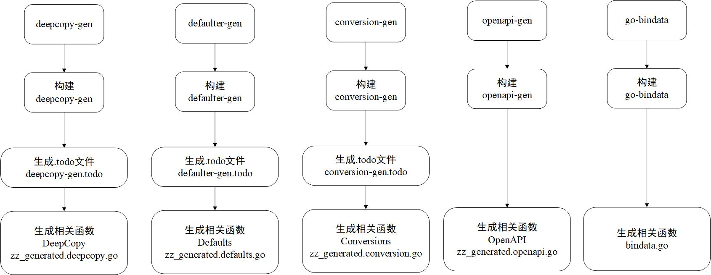
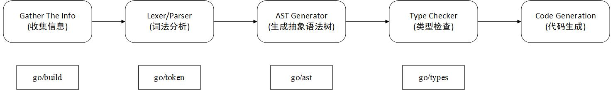

## 代码生成器

### 举例5个代码生成器

代码生成器 | 说明 
--- | ---
conversion-gen | 自动生成 Convert 函数的代码生成器，用于资源对象的版本转换函数
deepcopy-gen | 自动生成 DeepCopy 函数的代码生成器，用于资源对象的深复制函数
defaulter-gen | 自动生成 Defaulter 函数的代码生成器，用于资源对象的默认值函数
go-bindata | 是一个第三方工具，它能够将静态资源文件嵌入 Go 语言中
openapi-gen | 自动生成 OpenAPI 定义文件的代码生成器

### Tags 

代码生成器通过 Tags(标签)来识别一个包是否需要生成代码及确定生成代码的方式，Kubernetes 提供的 Tags 可以分为如下两种，Tags 被定义在注释中。

#### 全局 Tags

* 定义在每个包的 doc.go文件中，对整个包中的类型自动生成代码
* 代码示例如下：

```
// +k8s:deepcopy-gen=package
// +groupName=example.com
```

该示例表示为包中的每个类型自动生成 DeepCopy 函数，其中// +groupName定义了资源组名称，资源组名称一般用域名形式表示

#### 局部 Tags

* 定义在 Go 语言的类型声明上方，只对指定的类型自动生成代码
* 代码示例如下：

```
// +genclient
// +k8s:deepcopy-gen:interfaces=k8s.io/apimachinery/pkg/runtime.Object

// Pod...
```

该代码示例局部 Tags 定义在 Pod 资源类型的上方，定义并执行两个代码生成器。
> Kubernetes 的 API 文档生成器会根据类型声明的注释信息生成文档，为了避免 Tags 信息出现在文档中，所以将 Tags 定义在注释的上方并空一行

#### deepcopy-gen 代码生成器

给定一个包的目录路径作为输入源，它可以为其生成 DeepCopy 相关函数，这些函数可以有效地执行每种类型的深复制操作。

有如下几种 Tags 形式：
* 为整个包生成 DeepCopy 相关函数：
```
// +k8s:deepcopy-gen=package
```
* 为单个类型生成 DeepCopy 相关函数：
```
// +k8s:deepcopy-gen=true
```
* 为整个包生成 DeepCopy 相关函数时，可以忽略单个类型：
```
// +k8s:deepcopy-gen=false
```

* deepcopy-gen 会遍历包中所有类型，若类型为 types.Struct,则会为该类型生成深复制函数。

#### defaulter-gen 代码生成器

给定一个包的目录路径作为输入源，它可以为其生成 Defaulter 相关函数，这些函数可以为资源对象生成默认值。

* 为拥有不同属性的类型生成不同的 Defaulter 相关函数，其 Tags 形式如下：

```
// +k8s:defaulter-gen=TypeMeta/ListMeta/ObjectMeta
```

* defaulter-gen-input 说明当前包会依赖于指定的路径包，代码示例如下：

```
// +k8s:defaulter-gen-input=../../../vendor/k8s.io/api/rbac/v1
```

* defaulter-gen 会遍历包中所有类型，若类型属性拥有以上三种特定类型，则为该类型生成 Defaulter 函数，并为其生成 RegisterDefaults 注册函数。

#### conversion-gen 代码生成器

给定一个包的目录路径作为输入源，它可以为其生成 Convert 相关函数，这些函数可以为对象在内部和外部类型之间提供转换函数。

其 Tags 形式如下：

* 为整个包生成 Convert 相关函数

```
// +k8s:conversion-gen=<peer-pkg>
# <peer-pkg> 用于定义包的导入路径
```

* 为整个包生成 Convert 相关函数且依赖其他包时

```
// +k8s:conversion-gen-external-types=<type-pkg>
# <type-pkg> 用于定义其他包的路径
```

* 在排除某个属性后生成 Convert 相关函数

```
// +k8s:conversion-gen=false
```

* conversion-gen 会遍历包中所有类型，若类型为 types.Struct 且过滤掉了私有 Struct 类型，则为该类型生成 Convert 函数，并为该类型同时生成 RegisterConversions 注册函数

#### openapi-gen 代码生成器

给定一个包的目录路径作为输入源，它可以为其生成 OpenAPI 定义文件，该文件用于 kube-apiserver 服务上的 OpenAPI 规范的生成。

* 为特定类型或包生成 OpenAPI 定义文件时

```
// +k8s:openapi-gen=true
```

* 排除为特定类型或包生成 OpenAPI 定义时

```
// +k8s:openapi-gen=false
```

* openapi-gen 会遍历包中所有类型，若类型为 types.Struct 并忽略其他类型，则为 types.Struct 类型生成 OpenAPI 定义文件

#### go-bindata 代码生成器

给定一个静态资源目录路径作为输入源，go-bindata 可以为其生成 go 文件

## 代码生成过程

前面所提到的五种代码生成过程如下图所示



* .todo 文件相当于临时文件，用来存放被 Tags 标记过的包。通过 shell 的 grep 命令可以将所有代码包中被 Tags 标记过的包目录记录在 .todo 文件中，这样可以方便记录哪些包需要使用代码生成功能。

## gengo 代码生成核心实现

Kubernetes 的代码生成器都是在 k8s.io/gengo 包的基础上实现的，代码生成器都会通过一个输入包路径（--input-dirs）参数，根据 gengo 的词法分析、抽象语法树等操作，最终生成代码并输出（--output-file-base），gengo 代码目录结构说明如下：

* args: 代码生成器的通用 flags 参数。

* examples: 包含 deepcopy-gen、defaulter-gen、import-boss、set-gen等代码生成器的生成逻辑。

* generator: 代码生成器通用接口 Generator。

* namer: 命名管理，支持创建不同类型的名称。例如，根据类型生成名称，定义 type foo string，能够生成 func FooPrinter(f *foo){Print(string(*f))}

* parser: 代码解析器，用来构造抽象语法树。

* types: 类型系统，用于数据类型的定义及类型检查算法的实现。

### 代码生成逻辑与编译器原理



* Gather The Info: 收集 Go 语言源码文件信息及内容

* Lexer/Parser: 通过 Lexer 词法分析器进行一系列词法分析

* AST Generator: 生成抽象语法树

* Type Checker: 对抽象语法树进行类型检查

* Code Generation: 生成代码，将抽象语法树转换为机器代码

### 收集 Go 包信息

* 采用 go/build 工具，构建标签机制来构建约束条件，例如看代码时常看到类似于//+build linux darwin 的包注释信息，这就是 Go 语言编译时的约束条件，其也被称为条件编译。

> Go 语言的条件编译有两种定义方法：
> * 构建标签：在源码里添加注释信息，比如// +build linux,该标签决定了源码文件只能在 Linux 平台上才会被编译
> * 文件后缀：改变 Go 语言代码文件的后缀，比如 foo_linux.go，该后缀决定了源码文件只在 Linux 平台上才会被编译

* gengo 收集 Go 包信息可分为两步：第一步，为生成的代码文件设置构建标签；第二步，收集 Go 包信息并读取源码内容。

### 代码解析

代码解析流程分为三步：

1. 通过标准库 go/tokens 提供的 Lexer 词法分析器对代码文本进行词法分析，最终得到 Tokens;

2. 通过标准库 go/parser 和 go/ast 将 Tokens 构建为抽象语法树（AST）；

3. 通过标准库 go/types 下的 Check 方法进行抽象语法树类型检查，完成代码解析过程；

### 类型系统

gengo 的类型系统在 Go 语言本身的类型系统之上归类并添加了几种类型。在 Go 语言标准库 go/types 的基础上进行封装。所有的类型都通过 vendor/k8s.io/gengo/parser/parse.go 的 walkType 方法进行识别。gengo 类型系统中的 Struct、Map、Pointer、Interface等，与 Go 语言提供的类型并无差别。也有 gengo 与 Go 语言不同的类型，例如 Builtin、Alias、DeclarationOf、Unknown、Unsupported及Protobuf。另外，Signature并非是一个类型，它依赖于 Func 函数类型，用来描述 Func 函数的接收参数信息和返回值信息等。

如下举例：
#### Builtin（内置类型）

Builtin 将多种 Base 类型归类成一种类型，以下几种类型在 gengo 中统称为 Builtin 类型。

* 内置字符串类型——string
* 内置布尔类型——bool
* 内置数字类型——int、float、complex64等

#### Alias（别名类型）

举例如下：

```
type T1 struct{}
type T2 = T1
```

这里的 T2 相当于 T1 的别名，但在 Go 语言标准库的 reflect（反射）包识别 T2 的原始类型时，会将它识别为 Struct 类型，而无法将它识别为 Alias 类型，原因是，Alias 类型在运行时是不可见的。由于 gengo 依赖于 go/types 的 Named 类型，所以要让 Alias 类型在运行时可被识别，在声明时将 TypeName 对象绑定到 Named 类型即可。

#### DeclarationOf（声明类型）

它并不是严格意义上的类型，它是声明过的函数、全局变量、或常量，但未被引用过。

#### Unknown（未知类型）

当对象匹配不到以上所有类型的时候，它就是 Unknwn 类型的。

#### Unsupported（未支持类型）

当对象属于 Unkonwn 类型时，则会设置对象为 Unsupported 类型，并在其使用过程中报错。

#### Protobuf（Protobuf 类型）

由 go-to-protobuf 代码生成器单独处理的类型。

### 代码生成

Kubernetes 代码生成器生成的是 Go 语言代码。

Generator 接口字段说明如下：
> 位于 vendor/k8s.io/gengo/generator/generator.go 中

* Name: 代码生成器的名称，返回值为生成的目标代码文件名的前缀，例如 deepcopy-gen 的前缀为 zz_generated.deepcopy
* Filter: 类型过滤器，过滤掉不符合当前代码生成器所需的类型
* Namers: 命名管理器，支出创建不同类型的名称。例如，根据类型生成名称
* Init: 代码生成器生成代码之前的初始化操作
* Finalize: 代码生成器生成代码之后的收尾操作
* PackageVars: 生成全局变量代码块，例如 var...
* PackageConsts: 生成常量代码块，例如 consts...
* GenerateType: 生成代码块，根据传入的类型生成代码
* Imports: 获得需要生成的 import 代码块
* Filename: 生成目标代码文件的全名，例如 deepcopy-gen 的 zz_generated.deepcopy.go
* FileType: 生成代码文件的类型
> 如果代码生成器没有实现某些方法，则继承默认代码生成器(DefaultGen)的方法

下面以 deepcopy-gen 代码生成器为例，其代码生成原理如下：

首先通过 build.sh 脚本，手动构建 deepcopy-gen 代码生成器二进制文件，然后将需要生成的包 k8s.io/kubernetes/pkg/apis/abac/v1beta1 作为 deepcopy-gen 的输入源，并在内部进行一系列解析，最终通过 -O 参数生成名为 zz_generated.deepcopy.go 的代码文件,以下分步详解：

1. 实例化 generator.Packages 对象

* deepcopy-gen 代码生成器根据输入的包的目录路径（即输入源），实例化 generator.Packages 对象，根据 generator.Packages 结构生成代码；
* 最主要的是 GeneratorFunc 定义了 Generator 接口的实现，

2. 执行代码生成

在 gengo 中，generator 定义代码生成器通用接口 Generator。通过 ExecutePackage 函数，调用不同代码生成器的 Generator 接口方法，并生成代码。

ExecutePackage 代码生成执行流程：生成 Header 代码块 -> 生成 Imports 代码块 -> 生成 Vars 全局变量代码块 -> 生成 Consts 常量代码块 -> 生成 Body 代码块。最后，调用 assembler.AssembleFile 函数，将生成的代码块信息写入 zz_generated.deepcopy.go 文件，生成 pkg/apis/abac/v1beta1/zz_generated.deepcopy.go 代码结构。
