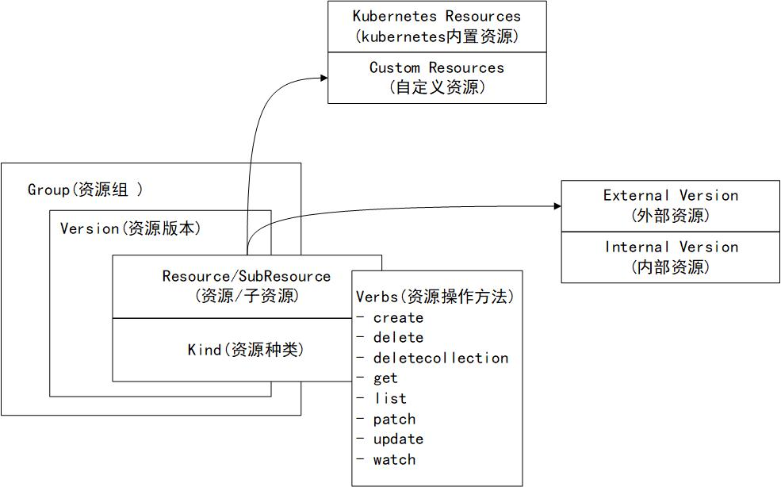

## Group、Version、Resource核心数据结构

在整个 Kubernetes 体系架构中，资源是 Kubernetes 最重要的概念，它本质上是一个资源控制系统————注册、管理、调度资源并维护资源的状态。

Kubernetes 将资源进行分组和版本化，形成 Group、Version、Resource。具体机构图如下：



* 部分资源同时会拥有自己的子资源，例如，Deployment 资源拥有 Status 子资源。

* 完整的表现形式为 <group>/<version>/<resource>/<subresource>

* 外部版本用于对外暴露给用户请求的接口所使用的资源对象。

* 内部版本不对外暴露，仅在 kubernetes api server 内部使用。

* kubernetes 的每个资源可使用 metav1.APIResource 结构进行描述，它描述资源的基本信息，例如资源名称，资源所属 命名空间，资源种类，资源可操作的方法列表。


```
resourceList := []*metav1.APIResourceList{
    {
        GroupVersion: "v1",
        APIResources: []metav1.APIResource{
            {
                Name: "pods", # 资源不存在资源组时
                Namespaced: true,
                Kind: "Pod",
                Verbs: []string{"get", "list", "delete", "deletecollection", "create", "update", "patch", "watch"},
            },
            {
                Name: "services",
                Namespaced: true,
                Kind: "Service",
                Verbs: []string{"get", "list", "delete", "deletecollection", "create", "update", "patch", "watch"},
            },
        },
    },
    {
        GroupVersion: "apps/v1", # 同时存在资源组和版本
        APIResources: []metav1.APIResource{
            {
                Name: "deployments",
                Namespaced: true,
                Kind: "Deployment",
                Verbs: []string{"get", "list", "delete", "deletecollection", "create", "update", "patch", "watch"},
            },
        },
    }
}
```

> 可以通过 Group、Version、Resource 结构来明确标识一个资源的资源组名称，资源版本及资源名称。简称 GVR。
> 常见的资源结构如下： GVR, GV, GR, GVK, GV, GK, GVS。

## Group

```
type APIGroup struct {
    Name string
    // 资源组名称
    Versions []GroupVersionForDiscovery
    // 资源组下所支持的资源组版本
    PreferredVersion GroupVersionForDiscovery
    // 首选版本
}
```

* 拥有组名的资源组：其表现形式为 <group>/<version>/<resouce>
> 拥有组名的资源组的 HTTP PATH 以 /apis 为前缀，其表现形式为 /apis/<group>/<version>/<resource> 

* 没有组名的资源组：被称为 Core Groups（即核心资源组）或 Legacy Groups，也可能被称为 GroupLess （即无组），其表现形式为 <version>/<resouce>
> 没有组名的资源组的 HTTP PATH 以 /api 为前缀，其表现形式为 /api/<version>/<resource>

## Version

分为三种版本，依次迭代顺序为 Alpha -> Beta -> Stable

```
type APIVersions struct {
    Versions []string
}
// Versions: 所支持的资源版本列表
```

## Resource

一个资源被实例化后会表达为一个资源对象（即 Resource Object），所有资源对象都是 Entity（实体）。

Kubernetes 目前支持的两种实体：
* 持久性实体（Persistent Entity）:在资源对象被创建够， Kubernetes 会持久确保该资源对象存在。大部分对象属于持久性实体，例如 Deployment 资源对象。
* 短暂性实体（Ephemeral Entity）:在资源对象被创建后，如果出现故障或调度失败，不会重新创建该资源对象，例如 Pod 资源对象。

```
type APIResource struct {
    Name string
    // 资源名称
    SingularName string
    // 资源的单数名称，它必须由小写字母组成，默认使用资源种类的小写形式进行命名。
    Namespaced bool
    // 资源是否拥有所属命名空间
    Group string
    Version string
    Kind string
    Verbs Verbs
    ShortNames []string
    // 资源的简称
}
```

### 资源外部版本和内部版本

* External Object: 外部版本用于对外暴露给用户请求的接口所使用的资源对象，用户通过 YAML/JSON 格式的描述文件创建资源对象时，所使用的是外部版本的资源对象，外部版本的资源对象通过资源版本（Alpha, Beta, Stable）进行标识。

* Internal Object: 内部版本不对外暴露，仅在 kubernetes api server 内部使用，内部版本用于多资源版本的转换。内部版本资源对象通过 runtime.APIVersionInternal (即_internal)进行标识。
> 资源版本（如 v1beta1,v1等）与外部版本/内部版本概念不同，拥有资源版本的资源属于外部资源，拥有 runtime.APIVersionInternal 标识的资源属于内部版本

* 资源的外部版本和内部版本是需要相互转换的，而用于转换的函数需要事先初始化到资源注册表（Scheme）中，多个外部版本之间的资源进行相互转换，都需要通过内部版本进行中转。**这也是 Kubernetes 能实现多资源版本转换的关键**

* 资源的外部版本和内部版本的代码定义也不太一样，外部版本的资源需要对外暴露给用户请求的接口，所以资源代码定义了 JSON/Proto Tags，而内部版本的资源不对外暴露，所以没有任何 Tags 定义。

### 资源代码定义

Kubernetes 内部版本和外部版本的资源代码结构并不相同。

* 资源的内部版本定义了所支持的资源类型（types.go）、资源验证方法（validation.go）、资源注册至资源注册表的方法（install/install.go）等。
* 资源的外部版本定义了资源的转换方法（conversion.go）、资源的默认值（defaults.go）等。
* 外部版本与内部版本资源类型相同，都通过 register.go 代码文件定义所属的资源组和资源版本，外部版本资源对象通过资源版本（Alpha、Beta、Stable）标识。

### 将资源注册到资源注册表中

在每一个 Kubernetes 资源组目录中，都拥有一个 install/install.go 代码文件，它负责将资源信息注册到资源注册表（Scheme）中。

* legancyschema.Scheme 是 kube-apiserver 组件的全局资源注册表，kubernetes 的所有资源信息都交给资源注册表统一管理。

* core.AddToScheme: 函数注册 core 资源组内部版本的资源。

* v1.AddToScheme: 函数注册 core 资源组外部版本的资源。

* scheme.SetVersionPriority: 函数注册资源组的版本顺序，如有多个资源版本，排在最前面的为资源首选版本。

### 资源操作方法

在 kubernetes 系统中，针对每一个资源都有一定的操作方法（即 Verbs）。

* 目前支持8中操作：create, delete, deletecollection, get, list, patch, update, watch，这些操作可以分为四大类，分别属于对资源进行创建、删除、更新和查询。

* 要了解一个资源对象拥有哪些可操作的方法，需要查看与存储相关联的源码包 registry。

### 资源与命名空间

kubernetes 系统中默认内置了4个命名空间，分别如下：
* default: 默认的命名空间
* kube-system: 所有由 kubernetes 系统创建的资源对象都会被分配给该命名空间
* kube-public: 此命名空间下的资源对象可以被所有人访问
* kube-node-lease: 此命名空间下存放来自节点的心跳记录
* 决定资源对象属于哪个命名空间，可通过资源对象的 ObjectMeta.Namespace 描述。

### 自定义资源

开发者通过 CustomResourceDefinitions（CRD）可以实现自定义资源，并将之添加到 Kubernetes 系统中。

kubernetes 资源可分为内置资源和自定义资源，它们都通过资源对象描述文件（Manifest File）进行定义。一个资源对象需要用5个字段来描述，这些字段定义在 YAML 或 JSON 文件中。

* apiVersion: 指定创建资源对象的资源组和资源版本
* kind: 指定创建资源对象的种类
* metadata: 描述创建资源对象的元数据信息，例如名称、命名空间等。
* spec: 包含有关资源对象的核心信息，包括资源状态、副本数量、环境变量、卷等信息。
* status: 包含有关正在运行的资源对象的信息。

## runtime.Object 类型基石

kubernetes 上的所有资源对象实际上就是一种 Go 语言的 Struct 类型，相当于一种数据结构，它们都有一个共同的结构叫 runtime.Object。runtime.Object 被设计为 Interface 接口类型，作为资源对象的通用资源对象。
> 例如： Pod 资源对象可以转换为 runtime.Object 通用资源对象，runtime.Object 通用资源对象也可以转换为 Pod 资源对象。


