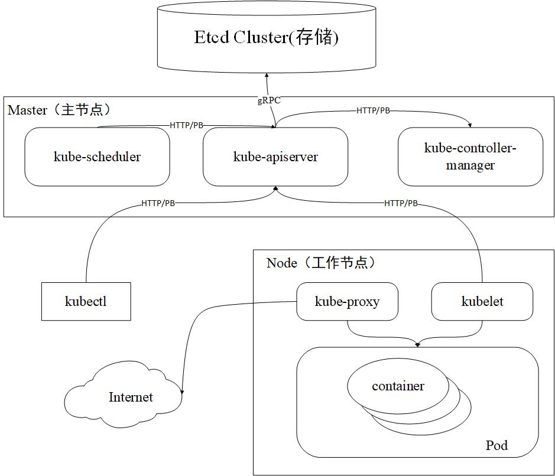

## Kubernetes架构图

## Kubernetes各组件功能

### kube-apiserver
* 集群的 HTTP REST API 接口，是集群控制的入口
* 也是集群中唯一与 Etcd 集群进行交互的核心组件
> Etcd 集群是分布式键值存储集群，提供了可靠的强一致性服务发现

### kube-controller-manager
* 集群中所有资源对象的自动化控制中心
* 每个控制器通过 kube-apiserver 组件提供的接口实时监控整个集群每个资源对象的当前状态，当因发生各种故障而导致系统状态出现变化时，会尝试将系统状态修复到“期望状态”
* Controller Manager 具备高可用性（多实例同时运行）
> 即基于 Etcd 集群上的分布式锁实现领导者选举机制，多实例同时运行，通过 kube-apiserver 提供的资源锁进行选举竞争。抢先获取锁的实例被称为 Leader 节点（即领导者节点），并运行该组件的主逻辑，而未获取锁的实例被称为 Candidate 节点（即候选节点），运行时处于阻塞状态。在 Leader 节点因某些原因退出后，Candidate 节点则通过领导者选举机制参与竞选，成为 Leader 节点后接替该组件的工作

### kube-scheduler 
* 集群中 Pod 资源对象的调度服务
* kube-scheduler 具备高可用性（多实例同时运行）具体同上
> 具体调度我会在后面仔细整理，里面其实很有趣好玩

### kubelet
* 负责管理节点上容器的创建、删除、启停等任务，与 Master 节点进行通信

### kube-proxy
* 负责 kubernetes 服务的通信及负载均衡服务
* 通过 iptables/ipvs 等配置负载均衡器，为一组 pod 提供统一的 TCP/UDP 流量转发和负载均衡功能

### container
* 负责容器的基础管理服务，接受 kubelet 组件的指令

### client-go
* 是从 kubernetes 代码中单独抽离出来的包，并作为官方提供的 Go 语言客户端发挥作用
* kubernetes 系统的其他组件与 kubernetes API Server 通信的方式也是基于 client-go 实现
> 因此在基于 kubernetes 做二次开发的过程中，建议通过 client-go 来实现与 kubernetes API Server 的交互过程

## Kubernetes Project Layout设计
| 源码目录 | 说明 | 
| --- | --- |
| cmd/ | 存放可执行文件的代码入口，每个可执行文件都会对应一个main函数 |
| pkg/ | 存放核心库代码， 可被项目内外部直接饮用 |
| vendor/ | 存放项目的依赖库代码，一般为第三方库代码 |
| api/ | 存放 OpenAPI/Swagger 的 spec 文件，包括 Json, Protocol 的定义等 |
| build/ | 存放构建相关的脚本 |
| test/ | 存放测试工具以及测试数据 | 
| docs/ | 存放设计或用户使用文档 |
| hack/ | 存放与构建和测试相关的脚本 |
| third_party/ | 存放第三方工具、代码和组件 |
| plugin/ | 存放 Kubernetes 插件代码目录，例如认证、授权等相关插件 |
| staging/ | 存放部分核心库的暂存目录 |
| translations/ | 存放用于支持不同语言的相关文件 |

## Kube-apiserver的初始化过程
1. **rand.Seed**: 组件中的全局随机数生成对象。
2. **app.NewCommand**: 实例化命令行参数。通过 flags 对命令行参数进行解析并存储至 Options 对象中。
3. **logs.InitLogs**: 实例化日志对象，用于日志管理。
4. **command.Execute**: 组件进程运行的逻辑。运行前通过 Complete 函数填充默认参数，通过 Validate 函数验证所有参数，最后通过 Run 函数持久运行。只有当进程收到退出信号时，进程才会退出。
> tips: Kubernetes 其他组件的 cmd 设计与之类似。