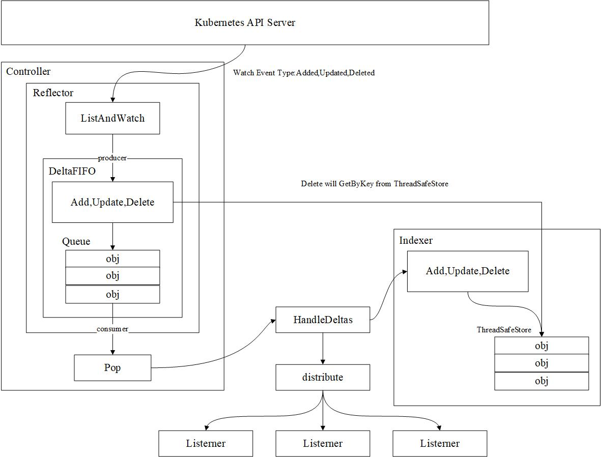

Kubernetes 的其他组件都是通过 client-go 的 Informer 机制与 Kubernetes API Server 进行通信的，并且保证消息的实时性、可靠性、顺序性等。

### Informer 机制架构设计



1. Reflector

Reflector 用于监控（Watch）指定的 Kubernetes 资源，当监控的资源发送变化时，触发相应的变更事件（例如 Added,Updated,Deleted），并将其资源对象存放到本地缓存 DeltaFIFO 中。

2. DeltaFIFO 

DeltaFIFO 可以分开理解，FIFO 是一个先进先出的队列，它拥有队列操作的基本方法，例如Add,Update,Delete,List,Pop,Close等，而 Delta 是一个资源对象存储，它可以保存资源对象的操作类型，例如Added,Updated,Deleted,Sync操作类型等。

3. Indexer

Indexer 是 client-go 用来存储资源对象并自带索引功能的本地存储，Reflector 从 DeltaFIFO 中将消费出来的资源对象存储至 Indexer。Indexer 与 Etcd 集群中的数据完全保持一致。client-go 可以很方便地从本地存储中读取相应的资源对象数据，而无须每次从远程 Etcd 集群中读取，以减轻 Kubernetes API Server 和 Etcd 集群的压力。

Informers Example 代码示例如下：

```
func main() {
    config, err := clientcmd.BuildConfigFromFlags("", "/root/.kube/config")
    if err != nil {
        panic(err)
    }

    clientset, err := kubernetes.NewForConfig(config)
    if err != nil {
        panic(err)
    }

    stopCh := make(chan struct{})
    defer close(stopCh)

    sharedInformers := informers.NewSharedInformerFactory(clientset, time.Minute)
    informer := sharedInformers.Core().V1().Pods().Informer()

    informer.AddEventHandler(cache.ResourceEventHandlerFuncs{
        AddFunc: func(obj interface{}) {
            mObj := obj.(v1.Object)
            log.Printf("New Pod Added to Store: %s", mObj.GetName())
        },
        UpdateFunc: func(oldObj, newObj interface{}) {
            oObj := oldObj.(v1.Object)
            nObj := newObj.(v1.Object)
            log.Printf("%s Pod Updated to %s", oObj.GetName(), nObj.GetName())
        },
        DeleteFunc: func(obj interface{}) {
            mObj := obj.(v1.Object)
            log.Printf("Pod Deleted from Store: %s", mObj.GetName())
        },
    })

    informer.Run(stopCh)
}
```

首先通过 kubernetes.NewForConfig 创建 clientset 对象，Informer 需要通过 ClientSet 与 Kubernetes API Server 进行交互。另外创建 stopCh 对象，该对象用于在程序进程退出之前通知 Informer 提前退出，因为 Informer 是一个持久运行的 goroutine。

* informers.NewSharedInformerFactory 函数实例化了 SharedInformer 对象，它接受两个参数，第一个参数 clientset 是用于与 Kubernetes API Server 交互的客户端，第二个参数 time.Minute 用于设置多久进行一次重新同步（resync），resync 会周期性地执行 List 操作，将所有的资源存放在 Informer Store 中，如果该参数为 0，则禁用 resync 功能。

* 通过 sharedInformers.Core().V1().Pods().Informer() 可以得到具体的 Pod 资源的 Informer 对象。

* 通过 informer.AddEventHandler 函数可以为 Pod 资源添加资源事件回调方法。

> 正常情况下， Kubernetes 的其他组件在使用 Informer 机制时触发资源事件回调方法，将资源对象推送到 WorkQueue 或其他队列中。

通过 Informer 机制可以很容易地监控我们所关心的资源事件，并通知 client-gp，告知 Kubernetes 资源事件变更了并且需要进行相应的处理。

1. 资源 Informer 

每一个 Kubernetes 资源上都实现了 Inforemer 机制，每一个 Informer 上都会实现 Informer 和 Lister 方法，例如 PodInformer,代码示例如下：

```
type PodInformer interface {
    Informer() cache.SharedIndexInformer
    Lister()  v1.PodLister
}
```

调用不同资源的 Informer，代码示例如下：

```
podInformer := sharedInformer.Core().V1().Pods().Informer()
nodeInformer := sharedInformer.Node().V1beta1().RuntimeClasses().Informer()
```

定义不同资源的 Informe，允许监控不同资源的资源事件。

2. Shared Informer 共享机制

Informer 也被称为 Shared Informer，它是可以共享使用的。若同一资源的 Informer 被实例化了多次，每个 Informer 使用一个 Reflector，那么会运行过多相同的 ListAndWatch，太多重复的序列化和反序列化操作会导致 Kubernetes API Server 负载过重。

Shared Informer 可以使同一资源 Informer 共享一个 Reflector，这样可以节约很多资源。通过 map 数据结构实现共享的 Informer 机制。Shared Informer 定义了一个 map 数据结构，用于存放所有 Informer 的字段，代码示例如下：

```
type sharedInformerFactory struct {
    ...
    informers map[reflect.Type]cache.SharedIndexInformer
}

func (f *sharedInformerFactory) InformerFor(obj runtime.Object, newFunc internalinterfaces.NewInformerFunc) cache.SharedIndexInformer{
    ...
    informerType := reflect.TypeOf(obj)
    informer, exists := f.informers[informerType]
    if exists {
        return informer
    }
    ...
    f.informers[informerType] = informer

    return informer
}
```

* informers 字段中存储了资源类型和对应于 SharedIndexInformer 的映射关系。
* informerFor 函数添加了不同资源的 Informer，在添加过程中如果已经存在同类型的资源 Informer，则返回当前 Informer，不再继续添加。
* 最后通过 Shared Informer 的 Start 方法使 f.informers 中的每个 informer 通过 goroutine 持久运行。

### Reflector

Informer 可以监控 Kubernetes 内置资源，也可以是 CRD 自定义资源，其中最核心的功能是 Refector。Reflector 用于监控（Watch）指定的 Kubernetes 资源，当监控的资源发送变化时，触发相应的变更事件（例如 Added,Updated,Deleted），并将其资源对象存放到本地缓存 DeltaFIFO 中。


