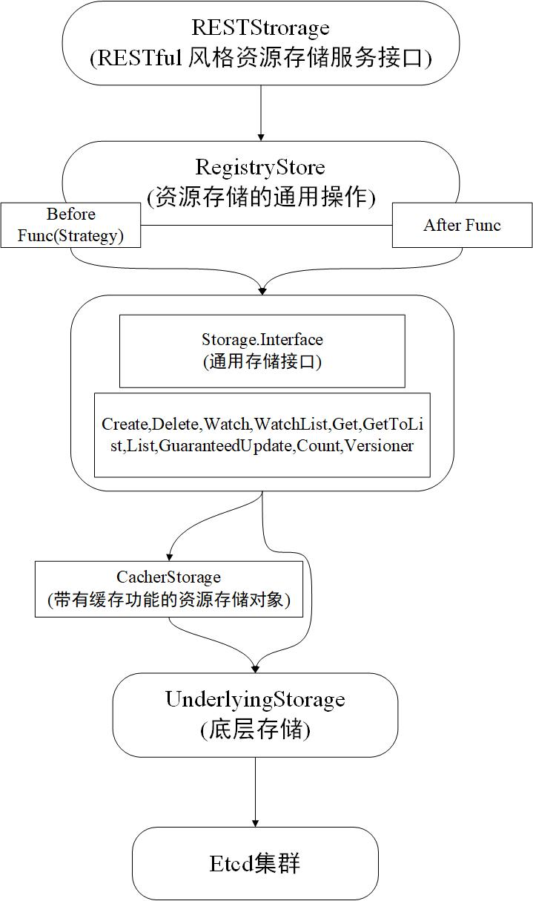

Etcd 集群存储 Kubernetes 系统的集群状态和元数据，其中包括所有 Kubernetes 资源对象信息，资源对象状态，集群节点信息等。Kubernetes 将所有数据存储至 Etcd 集群前缀为 /registry 的目录下。

## Etcd 存储架构设计



### RESTStorage

实现了 RESTful 风格的对外资源存储服务的 API 接口。

### RegistryStore

实现了资源存储的通用操作，例如，在存储资源对象之间或者之后执行某个函数。

### Storage.Interface 

通用存储接口，该接口定义了资源的操作方法。

### CacherStorage 

带有缓存功能的资源存储对象，它是 Storage.Interface 通用存储接口的实现。CacherStorage 缓存层的设计有利于 Etcd 集群中的数据能够获得快速的响应，并与 Etcd 集群数据保持一致。

### UnderlyingStorage

底层存储，也被称为 BackendStorage（后端存储），是真正与 Etcd 集群交互的资源存储对象，CacherStorage 相当于 UnderlyingStorage 的缓存层。UnderlyingStorage 同样也是 Storage.Interface 通用存储接口的实现。

## RESTStorage 存储服务通用接口

所有通过 RESTful API 对外暴露的资源必须实现 RESTStorage 接口。代码示例如下：

```
type Storage interface {
    New() runtime.Object
}
```

Kubernetes 资源一般通过 NewStorage 函数或 NewREST 函数实例化。以 Deployment 资源为例，代码示例如下：

```
type REST struct {
    *genericregistry.Store
    categories []string
}

type StatusREST struct {
    store *genericregistry.Store
}

type DeploymentStorage struct {
    Deployment *REST
    Status *StatusREST
    ...
}
```

Deployment 资源定义了 REST 数据结构与 StatusREST 数据结构，其中 REST 数据结构用于实现 deployment 资源的 RESTStorage 接口，而 StatusREST 数据结构用于实现 deployment/status 子资源的 RESTStorage 接口，每一个 RESTStorage 接口都对 RegistryStore 操作进行了封装，例如，对 deployment/status 子资源进行 Get 操作时，实际执行的是 RegistryStore 操作，代码示例如下：

```
func (r *StatusREST) Get(ctx context.Context, name string, options *metav1.GetOptions)(runtime.Object, error) {
    return r.store.Get(ctx, name, options)
}
```

## RegistryStore 存储服务通用操作

实现了资源存储的通用操作，例如，在存储资源对象之间或者之后执行某个函数。

RegistryStore 中定义了如下两种函数。

* Before Func：也称 Strategy 预处理，它被定义为在创建对象之前调用，做一些预处理工作。
* After Func：它被定义为在创建资源对象之后调用，做一些收尾工作。

最后，Storage 字段是 RegistryStore 对 Storage.Interface 通用存储接口进行的封装，实现了对 Etcd 集群的读/写操作。以 RegistryStore 的 Create 方法为例，代码示例如下：

```
func (e *Store) Create(...) (runtime.Object, error) {
    // 1. 进行预处理操作
    if err := rest.BeforeCreate(e.CreateStrategy, ctx, obj); err != nil {
        return nil, err
    }
    ...
    // 2. 创建资源对象
    if err := e.Storage.Create(ctx, key, obj, out, ttl, dryrun.IsDryRun(options.DryRun)); err != nil {
        ...
    }
    // 3. 执行收尾操作
    if e.AfterCreate != nil {
        if err := e.AfterCreate(out); err != nil {
            return nil, err
        }
    }
}
```

## Storage.Interface 通用存储接口

实现通用存储接口的分别是 CacherStorage 资源存储对象和 UnderlyingStorage 资源存储对象，分别介绍如下：

* CacherStorage：带有缓存功能的资源存储对象。
* UnderlyingStorage：底层存储对象，真正与 Etcd 集群交互的资源存储对象。

CacherStorage 实际上是在 UnderlyingStorage 之上封装了一层缓存层，在 genericregistry.StorageWithCacher 函数实例化的过程中，也会创建 UnderlyingStorage 底层存储对象。

在 CacherStorage 的实例化过程中，在装饰器函数里实现了 UnderlyingStorage 和 CacherStorage 的实例化过程，代码示例如下：

```
func StorageWithCacher(capacity int) generic.StorageDecorator {
    return func(
        ...
        s, d := generic.NewRawStorage(storageConfig)
        ...
        cacher := cacherstorage.NewCacherFromConfig(cacherConfig)
        ...
        return cacher, destroyFunc
    )
}
```

## CacherStorage 缓存层

缓存的应用场景非常广泛，可以使用缓存来降低数据服务器的负载、减少连接数等。

### CacherStorage 缓存层设计

CacherStorage 缓存层的设计有利于快速响应请求并返回所需的数据，这样可以减少 Etcd 集群的连接数，返回的数据也与 Etcd 集群中的数据保持一致。

缓存层并非会为所有操作都缓存数据。

* 例如 Create, Delete, Count 等操作，通过 UnderlyingStorage 直接向 Etcd 集群发出请求即可。

* 只有 Get, GetToList, List, GuaranteedUpdate, Watch, WatchList 等操作是基于缓存设计的。
> 其中 Watch 操作的事件缓存机制使用缓存滑动窗口保证历史事件不会丢失，设计较为巧妙。

CacherStorage 缓存层可分为如下部分：

1. cacheWatcher: Watcher 观察者管理。
2. watchCacher: 通过 Reflect 框架与 UnderlyingStorage 底层存储对象交互，UnderlyingStorage 与 Etcd 集群进行交互，并将回调事件分别存储至 w.onEvent, w.cache, cache.Store 中。
3. Cacher: 用于分发给目前所有已连接的观察者，分发过程通过阻塞机制实现。

#### cacheWatcher

每一个发送 Watch 请求的客户端都会分配一个 cacheWatcher,用于客户端接收 Watch 事件，代码示例如下：

```
func (c *Cacher) Watch(...)(watch.Interface, error) {
    ...
    watcher := newCacheWatcher(...)

    c.watchers.addWatcher(watcher, c.watcherIdx, ...)
    c.watcherIdx++
    return watcher, nil
}
```

当客户端发起 Watch 请求时，通过 newCacheWatcher 函数实例化 cacheWatcher 对象，并为其分配一个 id，该 id 是唯一的，从 0 开始计数，每次有新的客户端发送 Watch 请求时，该 id 会自增1,但在 Kubernetes API Server 重启时其会被清零。最后，将该对象添加到 c.watchers 中进行统一管理。

cacheWatcher 通过 map 数据结构进行管理，其中 key 为 id,value 为 cacheWatcher，代码示例如下：

```
type watchersMap map[int]*cacheWatcher
```

在通过 newCacheWatcher 函数进行实例化时，内部会运行一个 goroutine （即 watcher.process 函数），用于监控 c.input Channel 中的数据。当其中没有数据时，监控 c.input Channel 时处于阻塞状态；当其中有数据时，数据会通过 ResultChan 函数对外暴露，只发送大于 ResourceVersion 资源版本号的数据。代码示例如下：

```
func (c *cacheWatcher) process(initEvents []*watchCacheEvent, resourceVersion uint64){
    ...
    for event := range c.input {
        if event.ResorceVersion > resourceVersion {
            c.sendWatchCacheEvent(event)
        }
    }
}
```

#### watchCache

watchCacher: 通过 Reflect 框架与 UnderlyingStorage 底层存储对象交互，UnderlyingStorage 与 Etcd 集群进行交互，并将回调事件分别存储至 w.onEvent, w.cache, cache.Store 中。

watchCache 接收 Reflector 框架的事件回调，并实现了 Add, Update, Delete 方法，分别用于接收 watch.Added, watch.Modified, watch.Deleted 事件，通过 goroutine (即 w.processEvent 函数)将事件分别存储到如下 3 个地方：

1. w.onEvent: 将事件回调给 CacherStorage，CacherStorage 将其分发给目前所有已连接的观察者，该过程通过非阻塞机制实现。
2. w.cache: 将事件存储至缓存滑动窗口，它提供了对 Watch 操作的缓存数据，防止因为网络或者其他原因观察者连接中断，导致事件丢失。
3. cache.Store: 将事件存储至本地缓存，cache.Store 与 client-go 下的 Indexer 功能相同。

代码如下：

```
func (w *watchCache)processEvent(event watch.Event, resourceVersion uint64, updateFunc func(*storeElement) error) error {
    ...
    if w.onEvent != nil {
        w.onEvent(watchCacheEvent)
    }
    // watchCache 将接受到的事件通过 w.onEvent 函数回调给 CacherStorage。
    w.updateCache(resourceVersion, watchCacheEvent)
    ...
    return updateFunc(elem)
    // 通过 w.updateCache 存储至缓存滑动窗口，通过 updateFunc 函数存储至 cache.Store 本地缓存中。
}
```

#### Cacher 

Cacher 接收到 watchCache 回调的事件，遍历目前所有已连接的观察者，并将事件逐个分发给每个观察者，该过程通过非阻塞机制实现，不会阻塞任何一个观察者。

* 对于每一个 cacheWatcher,其内部都会运行一个 goroutine，用于监控 c.input Channel 中的数据，从而 cacheWatcher 获得相关事件，最终数据会通过 ResultChan 函数对外暴露。

### ResourceVersion 资源版本号

所有 Kubernetes 资源都有一个资源版本号，其用于表示资源存储版本，一般定义于资源的元数据中。

每次在修改 Etcd 集群存储的资源对象时，Kubernetes API Server 都会更改 ResourceVersion,使得 client-go 执行 Watch 操作时可以根据 ResourceVersion 来确定资源对象是否发生变化。

Kubernetes API Server 依赖于 Etcd 集群中的全局 Index 机制来进行管理的，在 Etcd 集群中，有两个比较关键的 Index，分别是 createIndex 和 modifiedIndex，它们用于跟踪 Etcd 集群中的数据发生了什么。

* createdIndex: 全局唯一递增的正整数，每次在 Etcd 集群中创建 Key 时其会递增。
* modifiedIndex: 与 createdIndex 功能类似，每次在 Etcd 集群中修改 key 时其会递增。

createdIndex 和 modifiedIndex 都是原子操作，Kubernetes 系统通过资源版本号的概念来实现乐观并发控制，也称乐观锁。它是一种并发控制的方法，当处理多客户端并发的事务时，事务之间不会影响，各事务能够在不产生锁的情况下处理各自影响那部分数据。在提交更新数据之前，每个事务都会检查在自己读取数据之后，有没有其他事务又修改了该数据，如果其他事务有更新过数据，那么正在提交数据的事务会进行回滚。

### watchCache 缓存滑动窗口

watchCache 使用缓存滑动窗口保存事件，其功能有些类似于 FIFO 队列，但实现方式不同，其数据结构如下：

```
type watchCache struct {
    capacity int
    // 缓存滑动窗口的大小
    cache []watchCacheElement
    // 缓存滑动窗口
    startIndex int
    // 开始下标
    endIndex int
    // 结束下标
}
```

初始时，startIndex 与 endIndex 都为 0。在接收到 Reflector 框架的事件回调后，将事件放入缓存滑动窗口的头部，此时 endIndex 与 capacity 会通过取模运算得到下一个事件的位置，然后 endIndex 会自增 1,当缓存滑动窗口满的时候，endIndex 与 capacity 会通过取模运算指定最先进入缓存滑动窗口的数据并覆盖该数据。watchCache 缓存滑动窗口代码示例如下：

```
func (w *watchCache) updateCache(resourceVersion uint64, event *watchCacheEvent) {
    if w.endIndex == w.startIndex + w.capacity {
        w.startIndex++
    }

    w.cache[w.endIndex%w.capacity] = watchCacheElement{resourceVersion, event}
    w.endIndex++
}
```

将 watchCache 与 ResourceVersion 结合，提供 Watch 操作的历史事件数据，ResourceVersion 断点续传机制如下：Actor-1 由于网络或其他原因，导致 Watch 操作中断，中断前监控到了 RV5 的数据，等网络恢复后，请求继续执行 Watch 操作并携带上 RV=5 的参数，这时 watchCache 则会从缓存滑动窗口中将历史 RV6, RV7, RV8 事件一次性返回给 Actor-1，假设 Actor-2 请求执行 Watch 操作并携带上 RV=0 的参数，这时 watchCache 则会从 cache.Store 本地缓存中获取历史事件返回给 Actor-2，代码示例如下：

```
func (w *watchCache) GetAllEventsSinceThreadUnsafe(resourceVersion uint64) ([]*watchCacheEvent, error) {
    size := w.endIndex -w.startIndex
    ...
    // 当 resourceVersion 为 0 时，从 cache.Store 本地缓存中获取历史事件并返回；
    if resourceVersion == 0 {
        allItems := w.store.List()
        result := make([]*watchCacheEvent, len(allItems))
        ...
        return result, nil
    }
    ...
    // 当 resourceVersion 大于 0 时，将 w.cache 缓存滑动窗口根据 resourceVersion 值的大小进行排序，并根据传入的 resourceVersion 按照区间获取历史事件。
    f := func(i int) bool {
        return w.cache[(w.startIndex+i)%w.capacity].resourceVersion > resourceVersion
    }
    first := sort.Search(size, f)
    result := make([]*watchCacheEvent, size-first)
    for i := 0; i < size - first; i++ {
        result[i] = w.cache[(w.startIndex+first+i)%w.capacity].watchCacheEvent
    }
    return result, nil
}
```

## UnderlyingStorage 底层存储对象

底层存储，也被称为 BackendStorage（后端存储），是真正与 Etcd 集群交互的资源存储对象，CacherStorage 相当于 UnderlyingStorage 的缓存层。

UnderlyingStorage 底层存储是对 Storage.Interface 通用存储接口的实现，分别提供了 Versioner,Create,Delete,Watch,WatchList,Get,GetList,List,GuaranteedUpdate,Count 方法。

资源对象在 Etcd 集群中以二进制形式存储，存储与获取过程都通过 protobufSerializer 编解码器进行数据的编码和解码。以 Get 操作为例，代码示例如下：

```
func (s *store) Get (ctx context.Context, key string, resourceVersion string, out runtime.Object, ignoreNotFound bool) error {
    key = path.Join(s.pathPrefix, key)
    getResp, err := s.client.KV.Get(ctx, key, s.getOps...)
    //（1）通过 s.client.KV.Get 获取 Etcd 集群中 Pod 资源对象的数据。
    ...
    return decode(s.codec, s.versioner, data, out, kv.ModRevision)
}

func decode(codec runtime.Codec, versioner storage.Versioner, value []byte, objPtr runtime.Object, rev int64) error {
    ...
    _, _, err := codec.Decode(value, nil, objPtr)
    //（2）通过 protobufSerializer 编解码器解码二进制数据，解码后的数据存放至 objPtr 中。
    if err != nil {
        return err
    }
    versioner.UpdateObject(objPtr, uint64(rev))
    // （3）最后通过 versioner.UpdateObject 函数更新最新的资源对象的 resourceVersion 资源版本号。
    return nil
}
```

## Codec 编解码数据

1. 实例化 Scheme 资源注册表及 Codecs 编解码器。
2. 通过 clientv3.New 函数实例化 Etcd Client 对象，并设置一些参数。
3. 通过 newCodec 函数实例化 runtime.Codec 编解码器，分别实例化 inCodec 编码器对象，outCodec 解码器对象。
4. 通过 runtime.Decodec 解码器（即 protobufSerializer）解码资源对象数据并通过 fmt.Println 函数输出。
5. 通过 runtime.Encodec 编码器（即 jsonSerializer）解码资源对象数据并通过 fmt.Println 函数输出。
 
 ## Strategy 预处理

 Strategy 预处理接口定义如下：

 ```
type GenericStore interface {
    GetCreateStrategy() rest.RESTCreateStrategy
    GetUpdateStrategy() rest.RESTUpdateStrategy
    GetDeleteStrategy() rest.RESTDeleteStrategy
    GetExportStrategy() rest.RESTExportStrategy
}
 ```